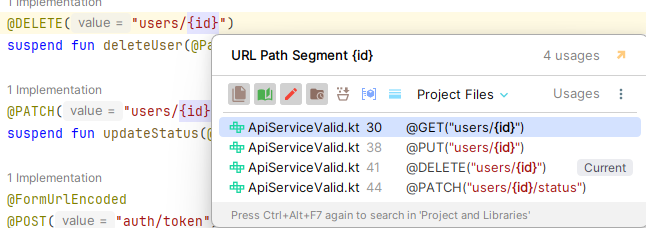
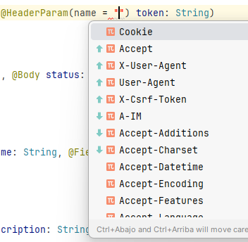

# ⚡ ktorgen — Kotlin + KSP + Ktor Client Code Generator


Ktorgen is a 100% compile-time code generator for creating HTTP clients using Ktor Client and interface annotations, inspired by [Retrofit](https://github.com/square/retrofit) and [Ktorfit](https://github.com/Foso/Ktorfit).

### 📌 Features

🔹 No runtime dependencies — you only need the annotations and the compiler in your build.

🔹 100% compatible with Kotlin, Kotlin Multiplatform,
[KSP 2](https://github.com/google/ksp), and [Ktor Client](https://ktor.io/).

🔹 100% Ktor configuration — no unnecessary overhead or wrappers added.

🔹 Annotation retention: SOURCE, BINARY (_only for RequiresOptIn_).

🔹 Generated code annotated with `@Generated` and `@Suppress` to avoid warnings and exclude of analysis tools.

🔹 Support [suspend fun](https://kotlinlang.org/docs/async-programming.html#coroutines),
[Coroutines Flow](https://kotlinlang.org/docs/flow.html) and
[Result](https://kotlinlang.org/api/core/kotlin-stdlib/kotlin/-result/) out of the box.

🔹 Optional type-safe headers, using `Headers.ContentTypes` or `Headers.Companion.*`

🔹 Optional inheritance between interfaces (use [delegation](https://kotlinlang.org/docs/delegation.html) to implement).

🔹 Experimental support for [vararg parameters](https://kotlinlang.org/docs/functions.html#variable-number-of-arguments-varargs) and
[Pair](https://kotlinlang.org/api/core/kotlin-stdlib/kotlin/-pair/) type.

📚 [More documentation of annotations](https://kingg22.github.io/ktorgen/).

## 📦 Instalación


Install [KSP plugin](https://github.com/google/ksp)

Install [Ktor Client Core and an Engine](https://ktor.io/docs/client-create-new-application.html#add-dependencies)

* Gradle
```kotlin
dependencies {
  implementation("io.github.kingg22:ktorgen-annotations:<current-version>")
  ksp("io.github.kingg22:ktorgen-compiler:<current-version>")
}
```

* Version Catalog
```toml
[versions]
ktorgen = "<current-version>"

[libraries]
ktorgen-annotations = { group = "io.github.kingg22", name = "ktorgen-annotations", version.ref = "ktorgen" }
ktorgen-compiler = { group = "io.github.kingg22", name = "ktorgen-compiler", version.ref = "ktorgen" }
```

## 🔄 Comparison
| Feature                               | Retrofit                             | Ktorfit                        | ktorgen 🚀                                                     |
|---------------------------------------|--------------------------------------|--------------------------------|----------------------------------------------------------------|
| Based on Ktor Client                  | ❌                                    | ✅                              | ✅                                                              |
| Runtime dependencies                  | ✅ (Reflection, converters, adapters) | ✅ (Converts)                   | ❌                                                              |
| Retrofit-like annotations             | ✅ (Runtime retention)                | ✅ + ⚠️ more annotations        | ✅ with _smart use_ that reduces unnecessary annotations        |
| Type-safe headers                     | ❌                                    | ❌                              | ✅ with `Headers.ContentTypes` and `Headers.Companion.*`        |
| Cookie support                        | ⚠️ using the Header annotation       | ⚠️ Using the Header annotation | ✅ with `@Cookie`                                               |
| Using an `@Part` without `@Multipart` | ❌                                    | ❌                              | ✅ (smart use, your intended use is understood)                 |
| Customizing the generated code        | Limited                              | Limited                        | ✅ Using options in `@KtorGen` and `@KtorGenFunction`           |
| Synchronous request                   | ✅                                    | ✅                              | ❌ Ktor Client don't offer synchronous request, only for `Flow` |

**BREAKING CHANGES:**
- Since [PR #1](https://github.com/kingg22/ktorgen/pull/1), Header annotations have been different:

  Before this PR, the API of annotation is "identical" to Retrofit annotations.

  Before on functions `@Headers("Content-Type: application/json")` after `@Header("Content-Type", "application/json")`

  Before on parameters `@Header("Content-Type") param: String` after `@HeaderParam("Content-Type") param: String`

- Feature:

  <details>
  <summary> Added jetbrains annotations to provide IDE autocompletion and highlights. </summary>
  <br>
  
  
  </details>

  Now `@Header` is repeatable and type-safe because follow the format `name: value` parse it,
  problems with vararg empty is very annoying.

### Additional configuration for Kotlin Multiplatform projects with code in commonMain
*If you're coming from ktorfit, this configuration was applied by the ktorfit gradle plugin.*
```kotlin
kotlin {
  sourceSets.commonMain {
    // Tell KMP to compile KSP metadata
    kotlin.srcDir("build/generated/ksp/metadata/commonMain/kotlin")
    dependencies {
      implementation(libs.ktorgen.annotations) // ktorgen annotations
      implementation(libs.ktor.client.core) // ktor client core and any plugins you need
    }
  }
}

dependencies {
  // For KMP projects, use instead of ksp(...)
  kspCommonMainMetadata(libs.ktorgen.compiler)
}

ksp {
  // optional, additional configuration for KSP
  arg("ktorgen_check_type", "2")
  /*
  0: Disable error checking
  1: Check errors
  2: Convert errors into warnings (default)
  */
}

// Workaround for KSP in KMP
tasks.named("runKtlintCheckOverCommonMainSourceSet") {
    dependsOn("kspCommonMainKotlinMetadata")
}

tasks.matching { it.name != "kspCommonMainKotlinMetadata" && it.name.startsWith("ksp") }
    .configureEach {
        dependsOn("kspCommonMainKotlinMetadata")
    }
```

## Samples
- [sample folder](https://github.com/kingg22/ktorgen/tree/main/sample)
- [deezer-client-kt](https://github.com/kingg22/deezer-client-kt)

- Demo source code

  

  Demo generated code

  

- Demo advanced usage

  

  Demo generated code

  

### 🔁 Migrating from Ktorfit to ktorgen
Migrating is as simple as:

Changing annotation imports to `io.github.kingg22.ktorgen.annotations.*`

Comma-separated header annotations are now repeatable and type-safe.

Before:

```kotlin
@Headers("Content-Type: application/json", "Accept: application/json")
suspend fun request(@Header("Authentication") token: String): String
```

After:

```kotlin
@Header("Content-Type", "application/json")
@Header("Accept", "application/json")
suspend fun request(@HeaderParam("Authentication") token: String): String
```

Passing your own Ktor HttpClient to the implementations, like this: `fun UserRoute(client)` for `interface UserRoute` and generated `class _UserRouteImpl`.

Real-life migration example: [deezer-client-kt](https://github.com/kingg22/deezer-client-kt/commit/98e7ccc360dc62861c6e9030650f681a99cddceb)

## 📜 Disclaimer
This repository is a fork of Ktorfit and Retrofit annotations, with my own changes and additions.
It is not affiliated with Ktor, JetBrains, Kotlin, Ktorfit, or Retrofit.
Credits to their respective authors.

[License: Apache 2.0](https://github.com/kingg22/ktorgen/blob/main/LICENSE.txt), same as Retrofit and Ktorfit.
